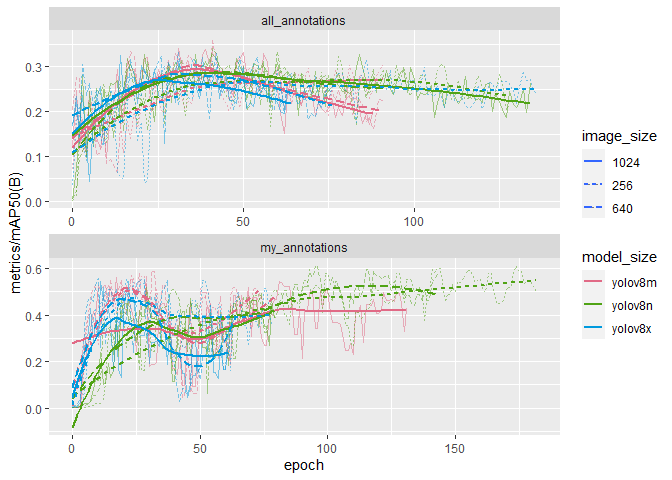

# Home excericse - NOVA course on deep learning in remote sensing
Julius Wold

# Introduction

## Objective

Compare the effect of training a seedling detector on your own annotated
dataset vs. the full dataset on the detector’s performance.

# Materials and methods

## Annotations

Two sets of annotations were used for model tranining: “My annotations”
and “All annotations”.

- “My annotations”
  - Annotations made by the author.
- “All annotations”
  - Annotations from all students merged.

“My annotations” consists of 48 images with 280 annotations of trees
while “All annotations” consists of 387 images with 5062 annotations.
70% of data was randomly assigned to training and 30% to validation. An
overview of images and annotations used in the tranining and validation
split are shown in [Table 1](#tbl-training).

| Count            | Split | All annotations | My annotations |
|:-----------------|:------|----------------:|---------------:|
| Number of images | Train |             271 |             34 |
| Number of images | Val   |             116 |             14 |
| Number of images | Sum   |             387 |             48 |
| Number of trees  | Train |            3492 |            201 |
| Number of trees  | Val   |            1570 |             79 |
| Number of trees  | Sum   |            5062 |            280 |

Table 1: Number of images and annotatations for each dataset.

## Model training

YOLOv8 models were trained using the dataset “My annotations” and the
dataset “All annotations”. A grid search were performed for model sizes
“Nano”, “Medium” and “Xtra large” and image sizes 256, 640 and 1024. The
best mode for each dataset were selected using mAP@.5.

| Model      | Image size |
|:-----------|-----------:|
| yolov8n.pt |        256 |
| yolov8n.pt |        640 |
| yolov8n.pt |       1024 |
| yolov8m.pt |        256 |
| yolov8m.pt |        640 |
| yolov8m.pt |       1024 |
| yolov8x.pt |        256 |
| yolov8x.pt |        640 |
| yolov8x.pt |       1024 |

Table 2: Grid search.

## Model evaluation

The selected models from the model training were evaluated using
machine-learning metris and domain metrics on the test data.

### ML metrics

Machine learning metrics were evaluated by testing the models against
tiled test data. Residual Mean Square Error (RMSE) and Mean Deviation
(MD) were calculated according to formula [Equation 1](#eq-rmse) and
[Equation 2](#eq-md) for observed and predicted trees per ha.
Additionally RMSE (%) and MD (%) were calculated by dividing RMSE and MD
by the observed mean.

## Domain metrics

$$
RMSE = \sqrt{\frac{\Sigma_{i=1}^{n}(y_i - \hat{y_i})^2}{n}}
 \qquad(1)$$

$$
MD = \frac{\Sigma_{i=1}^{n}(y_i - \hat{y_i})}{n}
 \qquad(2)$$

# Results & Discussion

## Model training

> Detailed view of trained models can be found in [this Comet
> project](https://www.comet.com/juliwold/home-exercise-sapling-detector/view/uxR2erf0uJlERPXPjybwdN2yE/panels).

### Training performance

Models trained by the “My annotation” dataset achived better performance
in training than the models trained on “All annotations”. For “My
annotation” the highest performance was acchived by the nano model with
image size 640 (mAP@.5 of 0.59 at epoch 94). The best perfoming model
for “All annotations” was the meduim model with an image size of 640
(mAP@.5 of 0.36 at epoch 42). Summary of training results are shown in
[Table 3](#tbl-trainingperformance-1) and
[Table 4](#tbl-trainingperformance-2).

| model      | imgsz | metrics/mAP50(B) | metrics/mAP50-95(B) | metrics/precision(B) | metrics/recall(B) | model/speed_PyTorch(ms) |
|:-----------|------:|-----------------:|--------------------:|---------------------:|------------------:|------------------------:|
| yolov8x.pt |  1024 |            0.545 |               0.228 |                0.551 |             0.544 |                  24.577 |
| yolov8x.pt |   640 |            0.511 |               0.235 |                0.664 |             0.456 |                  10.645 |
| yolov8x.pt |   256 |            0.536 |               0.211 |                0.551 |             0.575 |                   6.930 |
| yolov8m.pt |  1024 |            0.542 |               0.269 |                0.595 |             0.544 |                   9.502 |
| yolov8m.pt |   640 |            0.564 |               0.256 |                0.535 |             0.656 |                   6.573 |
| yolov8m.pt |   256 |            0.559 |               0.246 |                0.599 |             0.671 |                   7.859 |
| yolov8n.pt |  1024 |            0.519 |               0.228 |                0.692 |             0.455 |                   4.001 |
| yolov8n.pt |   640 |            0.593 |               0.281 |                0.602 |             0.669 |                   4.287 |
| yolov8n.pt |   256 |            0.553 |               0.252 |                0.590 |             0.570 |                   4.787 |

Table 3: My annotations

| model      | imgsz | metrics/mAP50(B) | metrics/mAP50-95(B) | metrics/precision(B) | metrics/recall(B) | model/speed_PyTorch(ms) |
|:-----------|------:|-----------------:|--------------------:|---------------------:|------------------:|------------------------:|
| yolov8x.pt |  1024 |            0.325 |               0.115 |                0.388 |             0.448 |                  25.644 |
| yolov8x.pt |   640 |            0.324 |               0.121 |                0.426 |             0.447 |                  10.408 |
| yolov8x.pt |   256 |            0.316 |               0.111 |                0.403 |             0.468 |                   2.897 |
| yolov8m.pt |  1024 |            0.328 |               0.126 |                0.413 |             0.460 |                   9.942 |
| yolov8m.pt |   640 |            0.364 |               0.129 |                0.393 |             0.526 |                   4.113 |
| yolov8m.pt |   256 |            0.336 |               0.111 |                0.376 |             0.445 |                   2.009 |
| yolov8n.pt |  1024 |            0.326 |               0.122 |                0.418 |             0.411 |                   2.320 |
| yolov8n.pt |   640 |            0.342 |               0.124 |                0.408 |             0.466 |                   1.595 |
| yolov8n.pt |   256 |            0.325 |               0.114 |                0.384 |             0.462 |                   1.216 |

Table 4: All annotations

Training performance of best models.

There was little impact on training perfomance with varying image size
and model size for models trained with “All annotations”. For models
trained with “My annotations” a difference can be observed between nano
models and medium and xtra large models. Medium and xtra large seems to
improve faster than nano models (higher performance at earlier epoch)
but are more prone to overfitting on the data. mAP@.5 curves for models
are shown in [Figure 1](#fig-training).

### Model speed

Increasing model size (Nano -\> Medium -\> Xtra large) resulted in
slower models. The effect of image size on model speed was greater with
increasing model size. Image size had little effect on nano models but
lead to much slower models for medium and xtra large models.

<table style="width:50%;">
<colgroup>
<col style="width: 50%" />
</colgroup>
<tbody>
<tr class="odd">
<td style="text-align: center;">

 

</td>
</tr>
</tbody>
</table>

Figure 2: Model speed (size of dots represents image size).

## Model evaluation

### ML metrics

The best model trained on “All annotations” outperformed the best model
trained on “My annotations”. ML metrics of the models are shown in
[Table 5](#tbl-mlmetrics).

|                                | metrics/precision(B) | metrics/recall(B) | metrics/mAP50(B) | metrics/mAP50-95(B) | fitness |
|:-------------------------------|---------------------:|------------------:|-----------------:|--------------------:|--------:|
| my_annotations_yolov8n.pt_640  |                 0.49 |              0.42 |             0.36 |                0.11 |    0.14 |
| all_annotations_yolov8m.pt_640 |                 0.56 |              0.45 |             0.38 |                0.12 |    0.14 |

Table 5: Machine learnining metrics.

### Domain

RMSE and MD of predicted trees per. ha are shown in
[Table 6](#tbl-domainmetrics).

| Model                          | aoi_name   | RMSE | RMSE (%) |   MD | MD (%) |
|:-------------------------------|:-----------|-----:|---------:|-----:|-------:|
| my_annotations_yolov8n.pt_640  | braatan    | 1436 |       98 | 1368 |     94 |
| my_annotations_yolov8n.pt_640  | galbyveien | 1613 |       80 | 1574 |     78 |
| my_annotations_yolov8n.pt_640  | hobol      |  761 |       70 |  759 |     70 |
| my_annotations_yolov8n.pt_640  | krakstad   | 1063 |       81 | 1054 |     80 |
| my_annotations_yolov8n.pt_640  | all        | 1262 |       86 | 1188 |     81 |
| all_annotations_yolov8m.pt_640 | braatan    |  981 |       67 |  891 |     61 |
| all_annotations_yolov8m.pt_640 | galbyveien |  692 |       34 |  662 |     33 |
| all_annotations_yolov8m.pt_640 | hobol      |   99 |        9 |   90 |      8 |
| all_annotations_yolov8m.pt_640 | krakstad   |  386 |       29 |  353 |     27 |
| all_annotations_yolov8m.pt_640 | all        |  632 |       43 |  499 |     34 |

Table 6: Domain metrics.

# Conclusion
